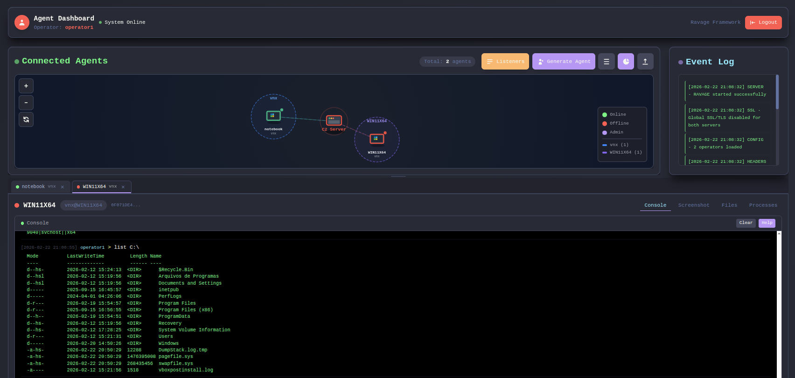

<div align="center">
  
  <h3>RAVAGE Framework | PowerShell Weaponized</h3>
  <p>stay stealth.</p>
</div>

## Overview

**RAVAGE** is a Command & Control (C2) framework designed for cybersecurity professionals, red teams, and penetration testers. It provides a secure, modular architecture with dynamic configuration, strong encryption, and advanced evasion techniques to simulate realistic attack scenarios, created by XPSec Security.

> **Note:** This framework is intended for educational purposes and authorized security testing only. Always obtain proper authorization before conducting security assessments.

## Key Features

- **Modular Architecture**: Clear separation between C2 server, admin interface, and agents
- **End-to-End Encryption**: Full SSL/TLS support with AES-256 encryption and random IV
- **Multi-Layer Obfuscation**: Advanced PowerShell and HTA obfuscation techniques
- **Interactive Dashboard**: Modern web interface with real-time agent monitoring
- **Dynamic Listener Management**: Create, start, and delete C2 listeners from the web panel at runtime
- **Traffic Profiles**: Reusable HTTP traffic patterns (headers, URIs, user-agent) assigned per listener
- **Secure File Operations**: Encrypted file transfer capabilities
- **Traffic Masquerading**: Header spoofing and content mimicking
- **Timing Randomization**: Configurable jitter for agent communication
- **In-Memory Execution**: Minimized disk operations to reduce forensic footprint

## Project Screenshots

<div align="center">
  
  <p><em>Graph view</em></p>

  
  <p><em>List view</em></p>
</div>

## Installation Guide

### Prerequisites

- Python 3.8+
- OpenSSL (for SSL certificate generation)

### Step-by-Step Setup

1. **Clone the repository**
```bash
git clone https://github.com/XPSec-Security/Ravage.git
cd Ravage
```

2. **Create and activate virtual environment**
```bash
python3 -m venv venv
source venv/bin/activate
```

3. **Install dependencies**
```bash
pip install -r requirements.txt
```

4. **Create SSL certificates**
```bash
mkdir certs
# For development/testing (self-signed)
openssl req -x509 -newkey rsa:4096 -keyout certs/server.key -out certs/server.crt -days 365 -nodes

# For production environments, use Let's Encrypt or proper CA-signed certificates
```

5. **Configure the framework**
```bash
cp profiles/profile.yaml.example profiles/profile.yaml
# Edit profiles/profile.yaml with your settings (see Configuration section)
```

6. **Launch the framework**
```bash
python main.py
```

## Configuration in Depth

The Ravage framework uses a single YAML configuration file located at `profiles/profile.yaml`.

### Core Configuration (`profile.yaml`)

```yaml
teamserver:
  bind:
    host: "0.0.0.0"      # Admin interface binding address
    port: 2053           # Admin interface port
    response_headers:    # Custom headers for disguising server identity
      - "Server: Microsoft-IIS/8.5"
      - "X-Powered-By: ASP.NET"

agent:
  sleep_time: 6          # Time in seconds between agent check-ins
  jitter: 20             # Random timing variation (percent)
  debug: false           # Enable/disable debug mode in agent

operators:
  - name: "operator1"
    credentials:
      password: "secure_password"  # Use strong passwords in production

aes_key:
  - data:
      key: "s3cure_AES_Key_Must_Be_32_Chars_Long"  # AES key for encryption (32+ chars)

ssl:
  enabled: true          # Enable SSL/TLS
  cert_file: "certs/server.crt"
  key_file: "certs/server.key"
  ssl_version: "TLSv1_2"
  ciphers: "HIGH:!aNULL:!MD5"

# Traffic profiles — define HTTP traffic patterns reused by listeners
profiles:
  - id: "default"
    description: "Default profile"
    http:
      user_agent: "Mozilla/5.0 (Windows NT 10.0; Win64; x64) AppleWebKit/537.36"
      uris:
        - "/account/login"    # Agent communication endpoint
        - "/search/?q=rvge"   # Dropper delivery endpoint
      request_headers:
        - "Accept: */*"
        - "Referer: https://google.com/"
      response_headers:
        - "content-type: text/html; charset=utf-8"
        - "server: cloudflare"
        - "cf-cache-status: HIT"
```

### Traffic Profiles

Profiles define the HTTP traffic pattern for a listener. You can define as many profiles as needed and assign them to different listeners via the web panel. Three built-in profiles are included in `profile.yaml.example`:

| Profile ID | Description |
|------------|-------------|
| `default` | Generic HTTP traffic with Cloudflare-like response headers |
| `youtube` | Mimics YouTube video browsing traffic |
| `teams` | Mimics Microsoft Teams API traffic |

## Listener Management

Listeners are created and managed at runtime through the **web dashboard** (Listeners tab). No restart is required. Each listener is independently configurable with the following fields:

| Field | Description |
|-------|-------------|
| **Name** | Friendly label for the listener |
| **Bind Host** | IP address the C2 server binds to (typically `0.0.0.0`) |
| **Bind Port** | Port the C2 server listens on |
| **Protocol** | `http` or `https` |
| **Traffic Profile** | Profile ID from `profile.yaml` (controls URIs, headers, user-agent) |
| **Upstream Host** | Value placed in the HTTP `Host` header by the agent (e.g. `cdn.microsoft.com`) |
| **External Host** | Public domain or IP the agent connects to (e.g. `c2.example.com` or your redirector IP) |

### Host Field Separation

Ravage cleanly separates three network roles to support redirector and CDN-fronting setups:

```
Agent  ──────────────────────►  External Host : Bind Port   (TCP connection target)
                                     │
                                     ▼
                              C2 Server listens on Bind Host : Bind Port
                              HTTP Host header = Upstream Host
```

- **Bind Host / Bind Port** — where the C2 process listens on the server
- **External Host** — the IP or domain the agent and dropper use to reach the C2 (redirector, CDN, or direct IP)
- **Upstream Host** — value injected into the HTTP `Host` header by the agent (used for domain fronting or CDN routing)

## Command Reference

| Category | Command | Description | Example |
|----------|---------|-------------|---------|
| **File Ops** | `upload` | Upload file to server | `upload C:\Windows\important.txt` |
| | `download` | Download file from agent | `download https://example.com/file.txt C:\path\to\save` |
| | `list` | List directory contents | `list C:\Users\Administrator\Desktop` |
| | `delete` | Delete file or directory | `delete C:\temp\evidence.txt` |
| | `fcopy` | Copy file or directory | `fcopy C:\temp\evidence.txt C:\exfil\loot.txt` |
| | `mkdir` | Create a directory | `mkdir C:\l00t` |
| **Process Mgmt** | `plist` | List running processes | `plist` |
| | `pkill` | Kill process by ID | `pkill 1234` |
| | `pname` | Find process by name | `pname explorer` |
| **PowerShell** | `shell` | Execute in isolated runspace | `shell Get-WmiObject Win32_OperatingSystem` |
| | `execute` | Execute local binary file | `execute C:\path\to\file.exe` |
| **Recon** | `screenshot` | Capture screen | `screenshot` |
| | `who` | Basic user information | `who` |
| **Stealth** | `asleep` | Adjust sleep interval | `asleep 10` (10s) |
| | `exit` | Terminate agent | `exit` |
| **Lateral Movement** | `make_token` | Create authentication token | `make_token DOMAIN\User:Password` |
| | `rev2self` | Reset process token to current user | `rev2self` |
| | `smb_exec` | Execute command via SMB | `smb_exec TARGET "whoami"` or `smb_exec TARGET "ipconfig /all" DOMAIN\User:Password` |
| | `wmi_exec` | Execute command via WMI | `wmi_exec TARGET "whoami"` or `wmi_exec TARGET "ipconfig /all" DOMAIN\User:Password` |

## Community

Join our community for support, updates, and collaboration:

- 🐛 [Discord](https://discord.gg/PXXDMzAxWM)

## ⚠️ Disclaimer

Ravage is designed for legal security testing and educational purposes only. Users are responsible for complying with all applicable laws. The developers assume no liability for misuse of this software.
