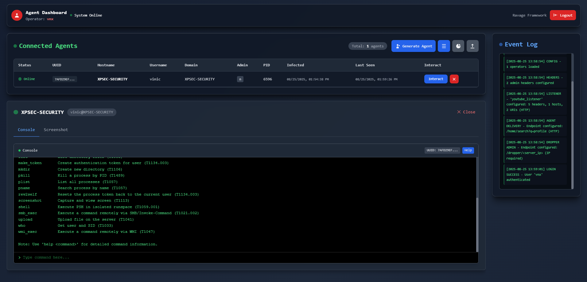
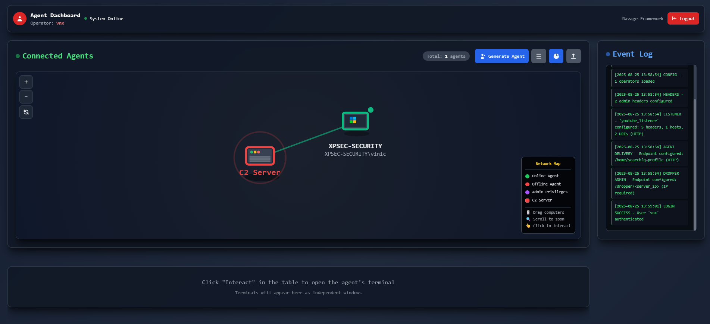

<div align="center">
  
  <h3>RAVAGE | PowerShell C2 Weaponized</h3>
  <p>stay stealth.</p>
</div>

## Overview

**RAVAGE** is a Command & Control (C2) framework designed for cybersecurity professionals, red teams, and penetration testers. It provides a secure, modular architecture with dynamic configuration, strong encryption, and advanced evasion techniques to simulate realistic attack scenarios.

> **Note:** This framework is intended for educational purposes and authorized security testing only. Always obtain proper authorization before conducting security assessments.

## 🔑 Key Features

- **Modular Architecture**: Clear separation between C2 server, admin interface, and agents
- **End-to-End Encryption**: Full SSL/TLS support with AES-256 encryption and random IV
- **Multi-Layer Obfuscation**: Advanced PowerShell and HTA obfuscation techniques
- **Interactive Dashboard**: Modern web interface with real-time agent monitoring
- **Secure File Operations**: Encrypted file transfer capabilities
- **Traffic Masquerading**: Header spoofing and content mimicking
- **Timing Randomization**: Configurable jitter for agent communication
- **In-Memory Execution**: Minimized disk operations to reduce forensic footprint

## 🖼️ Project Screenshots

<div align="center">
  
  <p><em>Command Execution and Results</em></p>
  
  
  <p><em>Dashboard Interface - Agent Management</em></p>
</div>

## 🚀 Installation Guide

### Prerequisites

```bash
# Required Python version
Python 3.8+

# Required packages
pip install flask pyyaml cryptography
```

### Step-by-Step Setup

1. **Clone the repository**
```bash
git clone https://github.com/XPSec-Security/Ravage.git
cd Ravage
```

2. **Create SSL certificates**
```bash
mkdir certs
# For development/testing (self-signed)
openssl req -x509 -newkey rsa:4096 -keyout certs/server.key -out certs/server.crt -days 365 -nodes

# For production environments, use Let's Encrypt or proper CA-signed certificates
```

3. **Configure the framework**
```bash
cp profiles/profile.yaml.example profiles/profile.yaml
# Edit profiles/profile.yaml with your settings (see Configuration section)
```

4. **Launch the framework**
```bash
python main.py
# or
python3 main.py
```

## ⚙️ Configuration in Depth

The Ravage framework uses YAML configuration profiles located in the `profiles/` directory to customize all aspects of operation.

### Core Configuration (`profile.yaml`)

```yaml
teamserver:
  bind:
    host: "0.0.0.0"      # Admin interface binding address
    port: 2053           # Admin interface port
    response_headers:    # Custom headers for disguising server identity
      - "Server: Microsoft-IIS/8.5"
      - "X-Powered-By: ASP.NET"

agent:
  sleep_time: 6          # Time in seconds between agent check-ins
  jitter: 20             # Random timing variation (percent)
  debug: false           # Enable/disable debug mode in agent

operators:
  - name: "operator1"    # Operator username
    credentials:
      password: "secure_password"  # Use strong passwords in production

aes_key:
  - data:
      key: "s3cure_AES_Key_Must_Be_32_Chars_Long"  # AES key for encryption (32+ chars)

ssl:
  enabled: true          # Enable SSL/TLS
  cert_file: "certs/server.crt"  # Path to certificate
  key_file: "certs/server.key"   # Path to private key
  ssl_version: "TLSv1_2"         # SSL/TLS version
  ciphers: "HIGH:!aNULL:!MD5"    # Cipher configuration

listeners:
  - id: "main_listener"  # Unique listener identifier
    profile:
      description: "Default C2 listener"
      bind:
        host: "0.0.0.0"  # Agent listener binding address
        port: 443        # Agent listener port
        protocol: "https"  # Communication protocol
      upstream:
        hosts:
          - "your-domain.com"  # Domain (or ip) for agent communications
      http:
        user_agent: "Mozilla/5.0 (Windows NT 10.0; Win64; x64) AppleWebKit/537.36"      # Agent user-agent
        uris:
          - "/account/login"    # Agent communication endpoint
          - "/search/?q=rvge"   # Dropper delivery endpoint
        request_headers:        # Custom request headers
          - "Accept: */*"
          - "Referer: https://your-domain.com/"
        response_headers:       # Custom response headers
          - "content-type: text/html; charset=utf-8"
          - "server: ESF"
          - "cf-cache-status: HIT"
```

## 🛠️ Usage Guide

### Starting the Framework

```bash
python main.py
# or
python3 main.py
```

This launches:
- **Admin Server**: `https://your-ip:2053` (Web dashboard)
- **C2 Server**: `https://your-ip:443` (Agent communication)

### Access Control

Navigate to the admin dashboard and authenticate with your operator credentials:
```
Username: [as configured in profile.yaml]
Password: [as configured in profile.yaml]
```

### Agent Deployment

1. **Generate Agent**:
   - Use the dashboard to generate a customized PowerShell agent
   - Configure listener, obfuscation level, and connection parameters

2. **Delivery Methods**:
   - **Direct Execution**: PowerShell one-liner
   - **Dropper**: PowerShell full dropper
   - **HTA File**: HTML Application with obfuscation

## 📋 Command Reference

| Category | Command | Description | Example |
|----------|---------|-------------|---------|
| **File Ops** | `upload` | Upload file to server | `upload C:\Windows\important.txt` |
| | `download` | Download file from agent | `download https://example.com/file.txt C:\path\to\save` |
| | `list` | List directory contents | `list C:\Users\Administrator\Desktop` |
| | `delete` | Delete file or directory | `delete C:\temp\evidence.txt` |
| | `fcopy` | Copy file or directory | `fcopy C:\temp\evidence.txt C:\exfil\loot.txt` |
| | `mkdir` | Create a directory | `mkdir C:\l00t` |
| **Process Mgmt** | `plist` | List running processes | `plist` |
| | `pkill` | Kill process by ID | `pkill 1234` |
| | `pname` | Find process by name | `pname explorer` |
| **PowerShell** | `shell` | Execute in isolated runspace | `shell Get-WmiObject Win32_OperatingSystem` |
| | `execute` | Execute local binary file | `execute C:\path\to\file.exe` |
| **Recon** | `screenshot` | Capture screen | `screenshot` |
| | `who` | Basic user information | `who` |
| **Stealth** | `asleep` | Adjust sleep interval | `asleep 10` (10s) |
| | `exit` | Terminate agent | `exit` |
| **Lateral Movement** | `make_token` | Create authentication token | `make_token DOMAIN\User:Password` |
| | `rev2self` | Reset process token to current user | `rev2self` |
| | `smb_exec` | Execute command via SMB | `smb_exec TARGET "whoami"` or `smb_exec TARGET "ipconfig /all" DOMAIN\User:Password` |
| | `wmi_exec` | Execute command via WMI | `wmi_exec TARGET "whoami"` or `wmi_exec TARGET "ipconfig /all" DOMAIN\User:Password` |

## 📞 Community

Join our community for support, updates, and collaboration:

- 🐛 [Discord](https://discord.gg/PXXDMzAxWM)

## ⚠️ Disclaimer

Ravage is designed for legal security testing and educational purposes only. Users are responsible for complying with all applicable laws. The developers assume no liability for misuse of this software.
